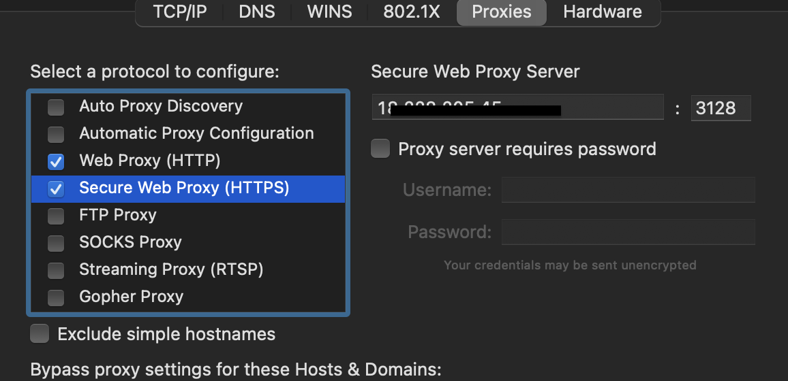
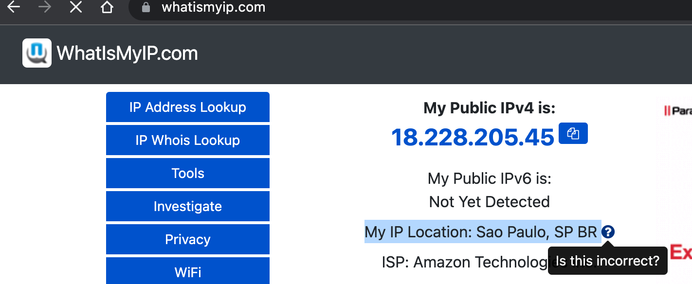

# config-squid

## Setup

1. Launch Amazon Linux

2. Install & setup Squid

```sh
# Localhost
scp -i path_to_ssh_key ./squid.conf ec2-user@ec2_ip_address:/tmp

# EC2
sudo yum update
sudo yum -y install squid
sudo cp /tmp/squid.conf /etc/squid/squid.conf
sudo service squid start
curl ip.fm
```

3. Use the proxy

